<div align="center">

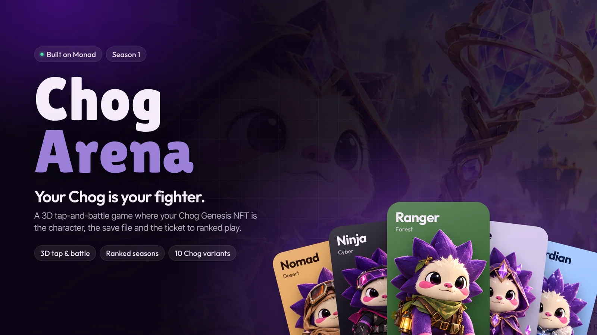

# Chog Arena

**A 3D tap-and-battle game on Monad where your Chog Genesis NFT is the fighter, the save file and the ticket to ranked play.**


[Play loop](#-how-it-plays) · [The Chogs](#-ten-chogs) · [Battles](#%EF%B8%8F-battles) · [Prize pool](#-prize-pool-and-economy) · [Architecture](#-architecture) · [Run it](#-run-it) · [Deploy](docs/DEPLOY.md)

</div>

---

## 📸 A look inside

<table>
  <tr>
    <td width="50%">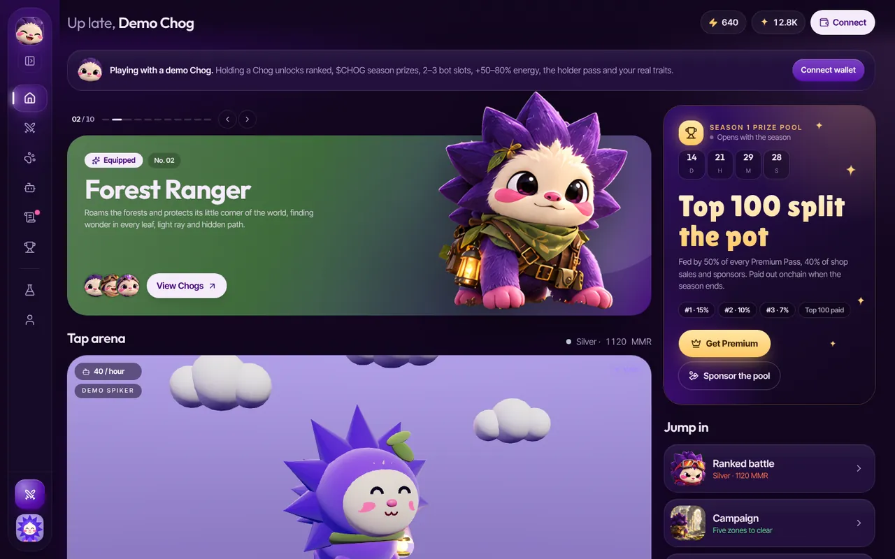<br/><sub><b>Home.</b> Featured Chog, the 3D tap arena and the live prize pool.</sub></td>
    <td width="50%">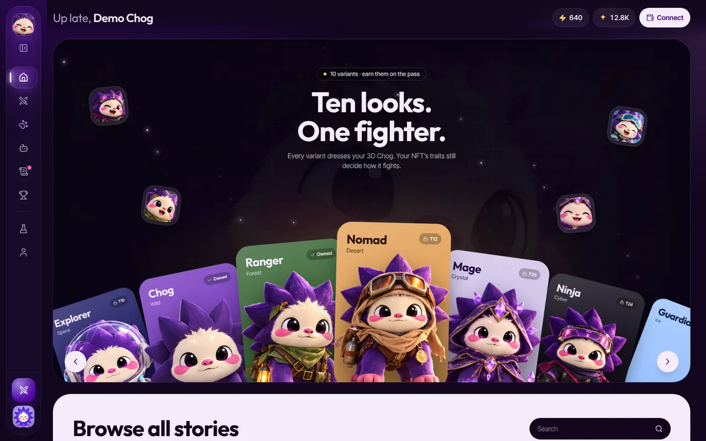<br/><sub><b>Ten looks, one fighter.</b> Every variant dresses your 3D Chog.</sub></td>
  </tr>
  <tr>
    <td width="50%">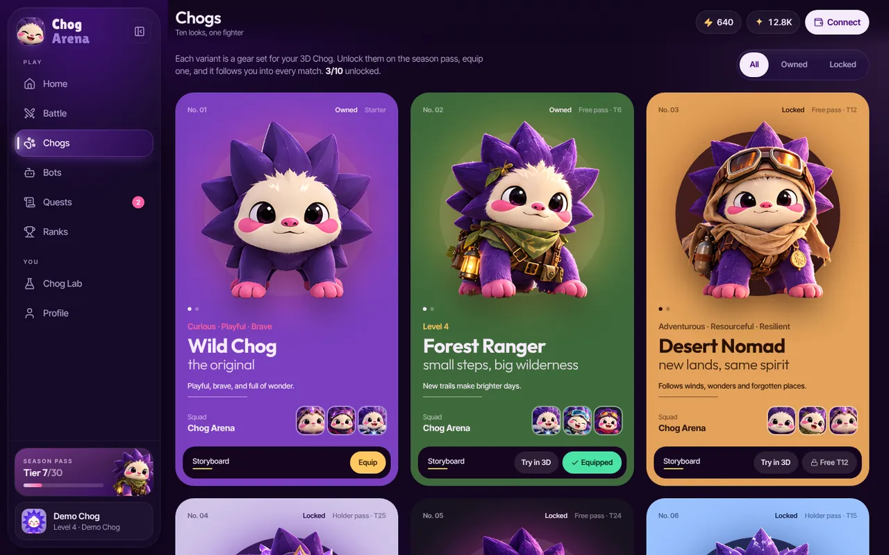<br/><sub><b>Chogs.</b> Profile cards with storyboards and "Try in 3D".</sub></td>
    <td width="50%">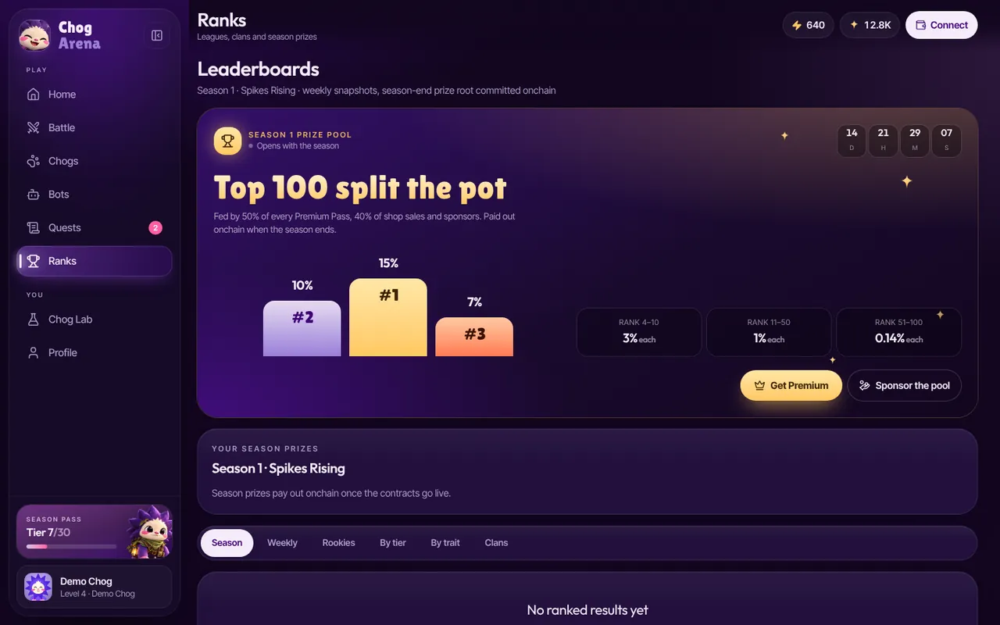<br/><sub><b>Ranks.</b> The season prize pool, podium and payout ladder.</sub></td>
  </tr>
</table>

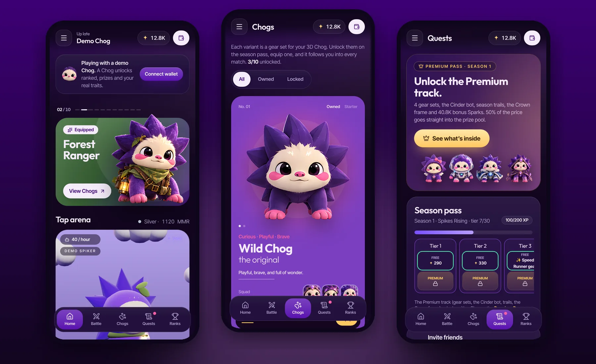

<sub>Mobile-first and installable as a PWA. The sidebar folds to an icon rail while you play and opens over the game instead of pushing it.</sub>

---

## 🔁 How it plays

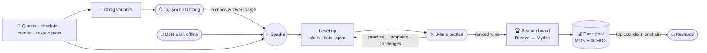
```mermaid
flowchart LR
    T(["👆 Tap your 3D Chog"]) -->|combos & Overcharge| S(("✨ Sparks"))
    B(["🤖 Bots earn offline"]) --> S
    S --> U["Level up<br/>skills · bots · gear"]
    U --> F{{"⚔️ 3-lane battles"}}
    F -->|ranked wins| R["🏆 Season board<br/>Bronze → Mythic"]
    F -->|practice · campaign · challenges| U
    R --> P[("💰 Prize pool<br/>MON + $CHOG")]
    P -->|top 100 claim onchain| W(["🎁 Rewards"])
    Q["📅 Quests · check-in · combo · season pass"] --> S
    Q --> G["🎽 Chog variants"]
    G --> T
```

- **Tap** for Sparks. Fast taps build a combo, and a full charge bar sets off an **Overcharge**. Daily boosts (Full Tank, Turbo ×3) speed things up.
- **Bots** keep earning while you're away. Merge two matching bots to level them up, and they join your battle deck.
- **Battle** in quick 3-lane, 6-turn matches against real Chogs from the collection, piloted by the arena AI at your MMR.
- **Progress lives on the token id.** Sell your Chog and its level, bots and record go with it.

## 🧬 Why the Chog matters

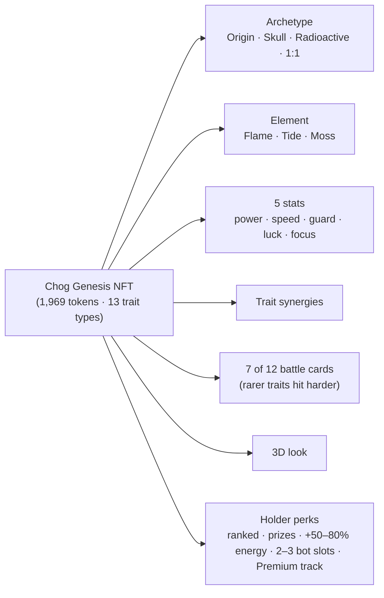
```mermaid
flowchart LR
    NFT["Chog Genesis NFT<br/>(1,969 tokens · 13 trait types)"] --> A["Archetype<br/>Origin · Skull · Radioactive · 1:1"]
    NFT --> E["Element<br/>Flame · Tide · Moss"]
    NFT --> ST["5 stats<br/>power · speed · guard · luck · focus"]
    NFT --> SY["Trait synergies"]
    NFT --> C["7 of 12 battle cards<br/>(rarer traits hit harder)"]
    NFT --> L["3D look"]
    NFT --> H["Holder perks<br/>ranked · prizes · +50–80% energy · 2–3 bot slots · Premium track"]
```

The game reads the real collection from chain and IPFS. Ownership is checked onchain at the moment you play ranked. Guests get a demo Chog, so anyone can see the whole loop before buying in.

## 🎽 Ten Chogs

Ten hand-designed variants from the project owner's character sheets. Each one is a 3D gear set for your Chog, earned on the season pass, with a profile card and a five-scene storyboard.

<table>
  <tr>
    <td align="center">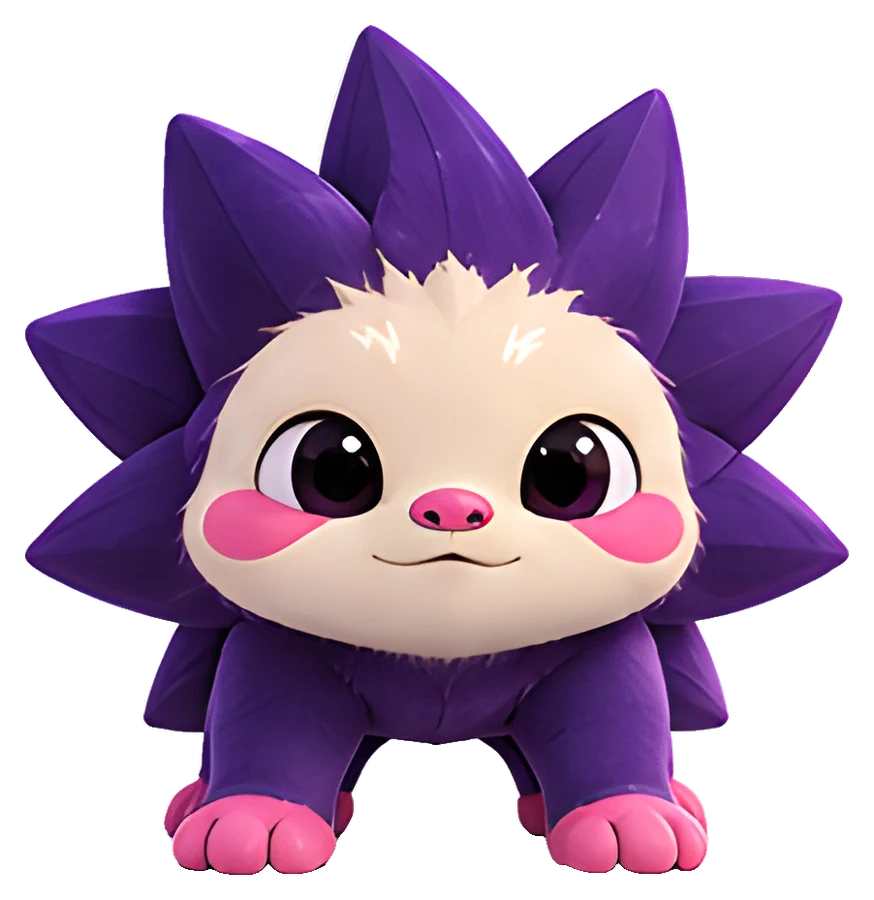<br/><b>Wild Chog</b><br/><sub>Starter</sub></td>
    <td align="center">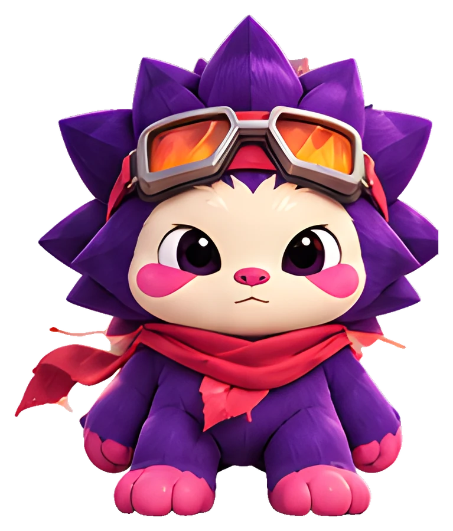<br/><b>Speed Runner</b><br/><sub>Free · tier 3</sub></td>
    <td align="center">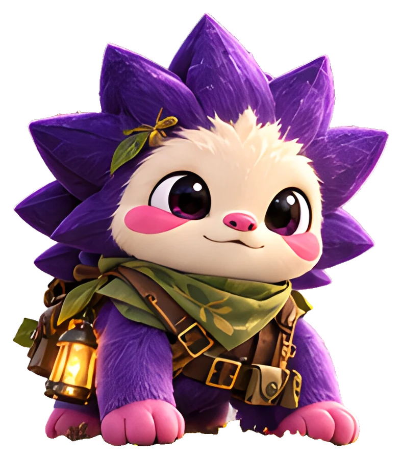<br/><b>Forest Ranger</b><br/><sub>Free · tier 6</sub></td>
    <td align="center">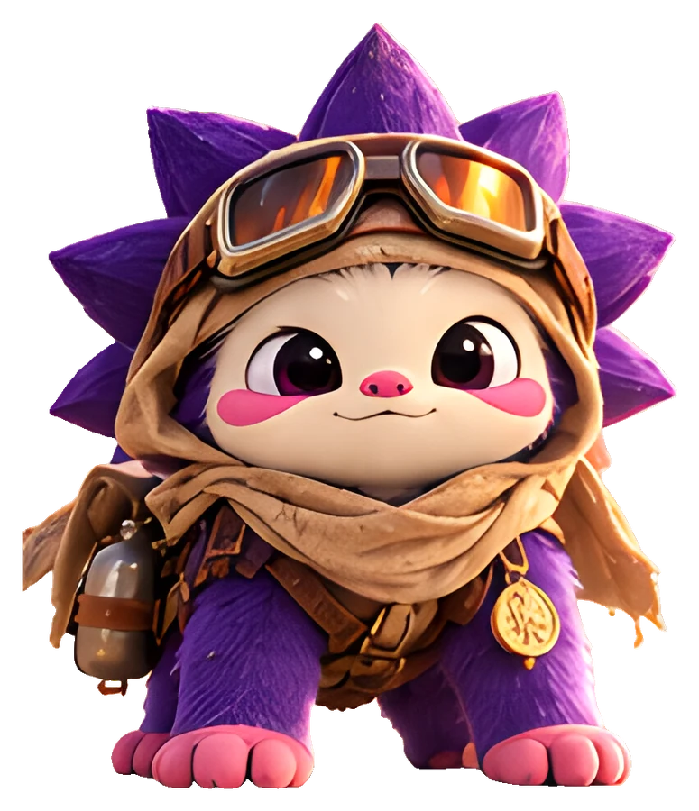<br/><b>Desert Nomad</b><br/><sub>Free · tier 12</sub></td>
    <td align="center">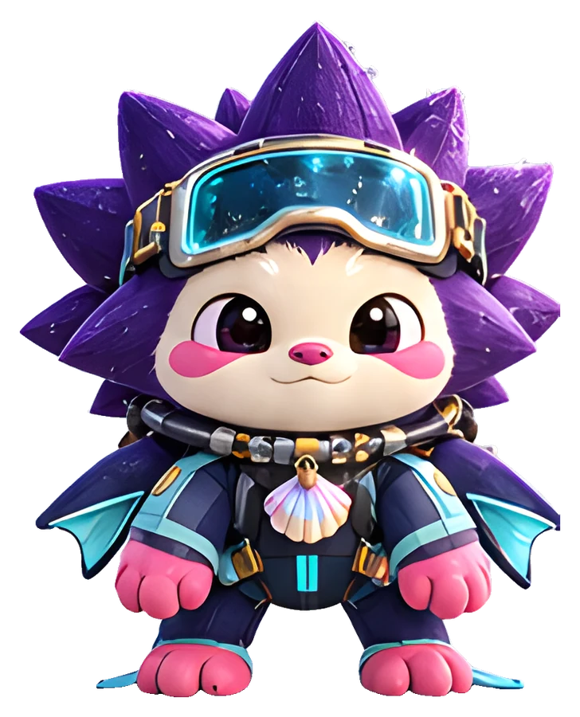<br/><b>Ocean Diver</b><br/><sub>Free · tier 18</sub></td>
  </tr>
  <tr>
    <td align="center">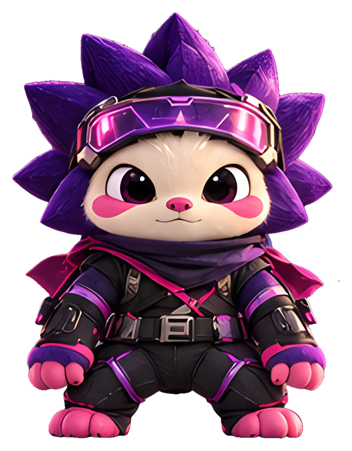<br/><b>Cyber Ninja</b><br/><sub>Free · tier 24</sub></td>
    <td align="center"><br/><b>Cozy Hoodie</b><br/><sub>Premium · tier 5</sub></td>
    <td align="center">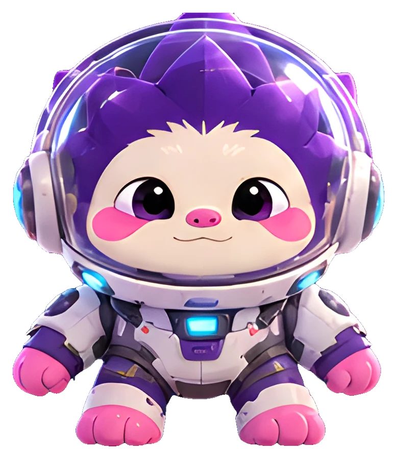<br/><b>Space Explorer</b><br/><sub>Premium · tier 10</sub></td>
    <td align="center">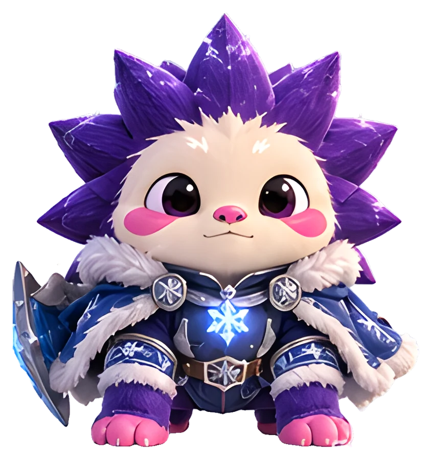<br/><b>Ice Guardian</b><br/><sub>Premium · tier 15</sub></td>
    <td align="center">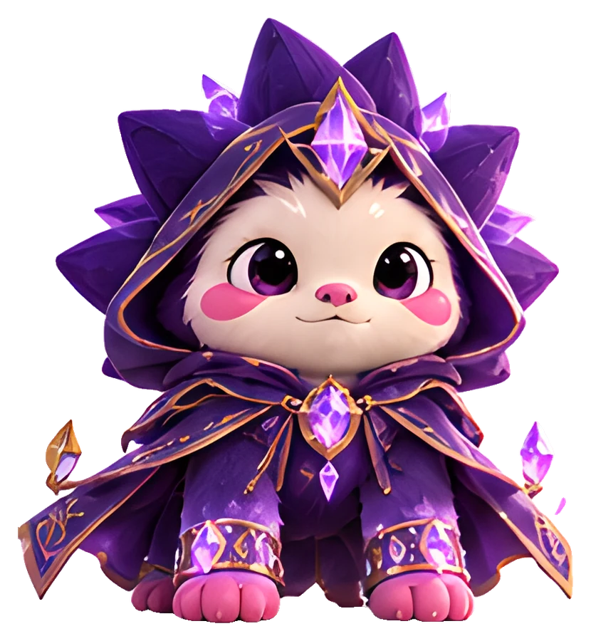<br/><b>Crystal Mage</b><br/><sub>Premium · tier 25</sub></td>
  </tr>
</table>

All art is cut from the owner's sheets and upscaled 4× with Real-ESRGAN, so nothing in the UI is shown larger than its pixels. The pipeline lives in [`scripts/art`](scripts/art) (see [ASSETS.md](ASSETS.md)).

## ⚔️ Battles

Three lanes, six turns. Play cards up to your energy, reveal together, and **win two of the three lanes**. Each lane has its own rule, and elements matter:

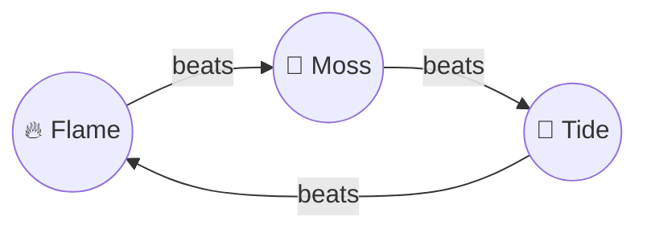
```mermaid
flowchart LR
    Flame(("🔥 Flame")) -- beats --> Moss(("🌿 Moss"))
    Moss -- beats --> Tide(("🌊 Tide"))
    Tide -- beats --> Flame
```

| Mode | Who | What's at stake |
|---|---|---|
| **Ranked** | Chog holders | MMR, league, season board, prize eligibility. Replayed on the server and signed for Monad |
| **Campaign** | Everyone (zone 5 for holders) | Five zones, bosses, first-clear Sparks |
| **Practice** | Everyone | A relaxed match at quarter rewards |
| **Challenge a friend** | Everyone | A share link with the same seed and lanes, so you can try to top their score |

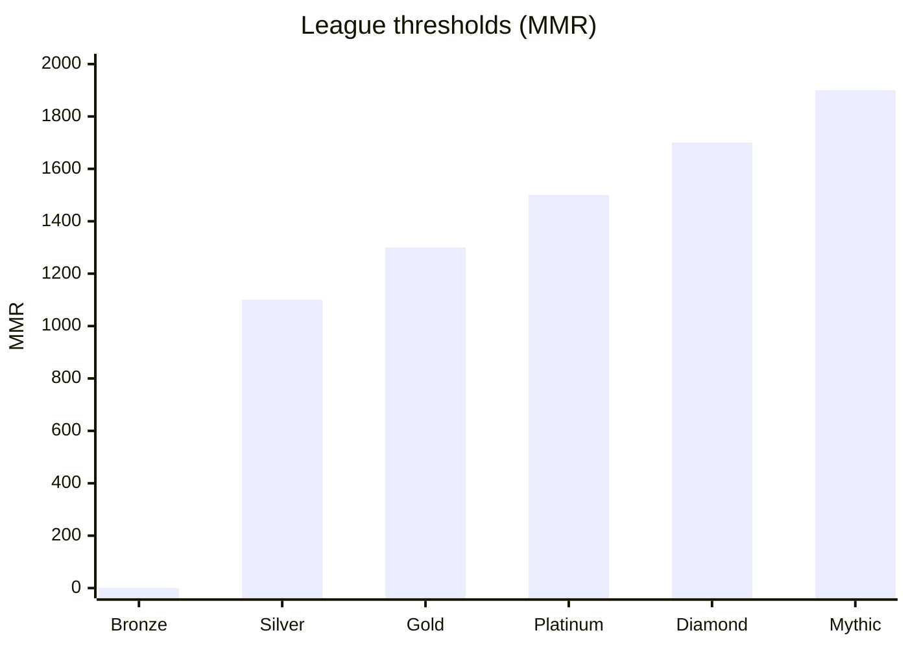
```mermaid
xychart-beta
    title "League thresholds (MMR)"
    x-axis [Bronze, Silver, Gold, Platinum, Diamond, Mythic]
    y-axis "MMR" 0 --> 2000
    bar [0, 1100, 1300, 1500, 1700, 1900]
```

## 💰 Prize pool and economy

Every season, the top 100 on the board split two pools: **MON** and **$CHOG**. The pools fill from real spending, not new tokens.

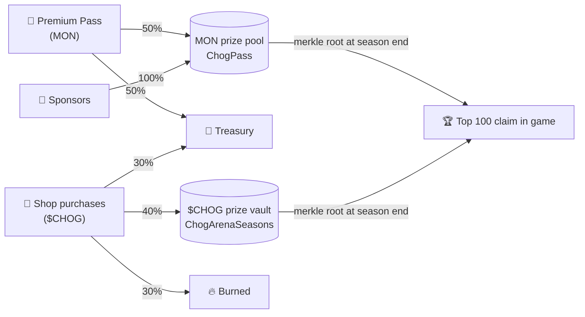
```mermaid
flowchart LR
    PP["👑 Premium Pass<br/>(MON)"] -->|50%| MP[("MON prize pool<br/>ChogPass")]
    PP -->|50%| TR["🏦 Treasury"]
    SP["🤝 Sponsors"] -->|100%| MP
    SH["🛒 Shop purchases<br/>($CHOG)"] -->|40%| CP[("$CHOG prize vault<br/>ChogArenaSeasons")]
    SH -->|30%| BURN["🔥 Burned"]
    SH -->|30%| TR
    MP -->|merkle root at season end| TOP["🏆 Top 100 claim in game"]
    CP -->|merkle root at season end| TOP
```

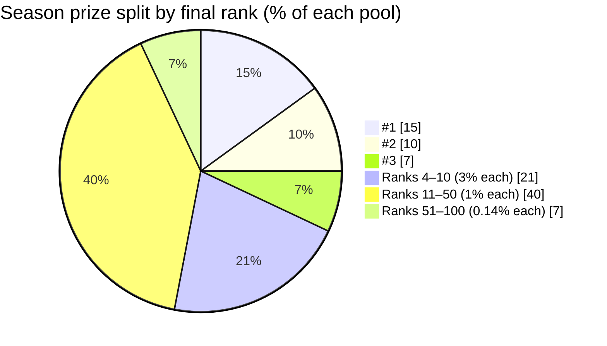
```mermaid
pie showData
    title Season prize split by final rank (% of each pool)
    "#1" : 15
    "#2" : 10
    "#3" : 7
    "Ranks 4–10 (3% each)" : 21
    "Ranks 11–50 (1% each)" : 40
    "Ranks 51–100 (0.14% each)" : 7
```

- **Premium Pass:** bought per season in MON. It unlocks the Premium track (4 gear sets, the Cinder bot, trails, the Crown frame, 40.8K bonus Sparks). Chog holders get it free. It's cosmetics and Sparks only and never changes ranked strength.
- **Sponsor the pool:** anyone can add MON to the season pool with a public note.
- **Claims:** prizes go to whoever owns each ranked Chog at the snapshot, and are claimed from a merkle proof in the Ranks screen. Double claims revert, and unclaimed funds roll into the next season.
- **Invites** pay energy and cosmetics, never tokens. **Clan chests** pay Sparks at shared milestones.

## 🏗 Architecture

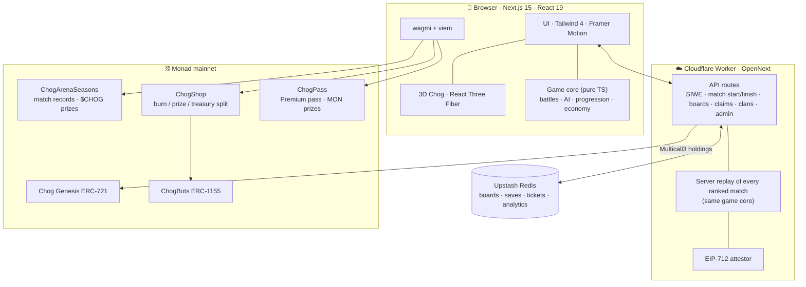
```mermaid
flowchart TB
    subgraph Client["📱 Browser · Next.js 15 · React 19"]
      UI["UI · Tailwind 4 · Framer Motion"]
      R3F["3D Chog · React Three Fiber"]
      GAME["Game core (pure TS)<br/>battles · AI · progression · economy"]
      W3["wagmi + viem"]
    end
    subgraph Edge["☁️ Cloudflare Worker · OpenNext"]
      API["API routes<br/>SIWE · match start/finish · boards · claims · clans · admin"]
      REPLAY["Server replay of every ranked match<br/>(same game core)"]
      ATT["EIP-712 attestor"]
    end
    KV[("Upstash Redis<br/>boards · saves · tickets · analytics")]
    subgraph Monad["⛓ Monad mainnet"]
      NFT["Chog Genesis ERC-721"]
      SEASONS["ChogArenaSeasons<br/>match records · $CHOG prizes"]
      SHOP["ChogShop<br/>burn / prize / treasury split"]
      BOTS["ChogBots ERC-1155"]
      PASS["ChogPass<br/>Premium pass · MON prizes"]
    end
    UI --- R3F
    UI --- GAME
    UI <--> API
    API --- REPLAY --- ATT
    API <--> KV
    API -->|Multicall3 holdings| NFT
    W3 --> SEASONS & SHOP & PASS
    SHOP --> BOTS
```

### A ranked match, end to end

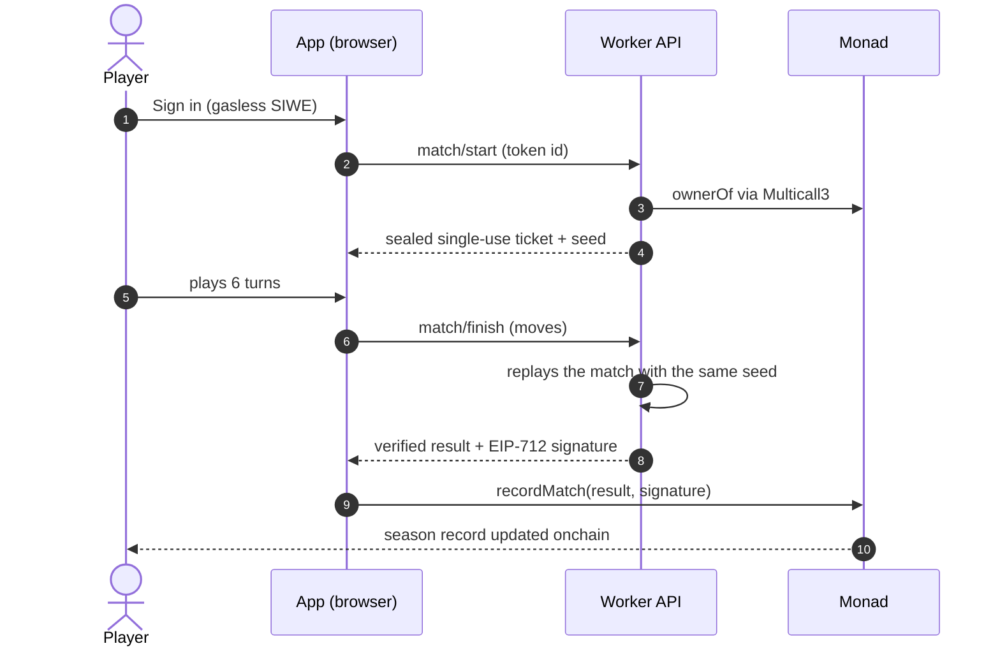
```mermaid
sequenceDiagram
    autonumber
    actor P as Player
    participant App as App (browser)
    participant API as Worker API
    participant Chain as Monad
    P->>App: Sign in (gasless SIWE)
    App->>API: match/start (token id)
    API->>Chain: ownerOf via Multicall3
    API-->>App: sealed single-use ticket + seed
    P->>App: plays 6 turns
    App->>API: match/finish (moves)
    API->>API: replays the match with the same seed
    API-->>App: verified result + EIP-712 signature
    App->>Chain: recordMatch(result, signature)
    Chain-->>P: season record updated onchain
```

Ranked results are server-authoritative: the client only sends moves, and the Worker replays them with the shared game core before signing anything.

## 🚀 Run it

```bash
npm install
cp .env.example .env.local     # optional: everything has safe defaults
npm run dev                    # http://localhost:3000
```

| Task | Command |
|---|---|
| App tests: rules, replay, economy, prizes, moderation, boosts, and every one of the 1,969 tokens building a valid deck | `npm test` |
| Type check | `npm run lint` |
| Contract tests (35, including fuzzing) | `cd contracts && forge test` |
| Preview in the Workers runtime | `npm run preview` |
| Deploy to Cloudflare Workers | `npm run deploy` |
| Build a season payout root ($CHOG or MON) | `npm run prizes:build -- --site … --season 1 --pool … [--asset mon]` |
| Re-index the collection from chain | `npm run index:chogs` |

Every key, step by step: **[docs/DEPLOY.md](docs/DEPLOY.md)**. Season operations are in step 11. The owner console (players, income, live ops) and how to lock it down: **[docs/ADMIN.md](docs/ADMIN.md)**.

### Try it

1. Open the app on a phone. The tutorial shows the loop in four cards.
2. **No wallet:** tap the demo Chog, equip a bot, play Practice or Campaign. Ranked shows exactly why it needs a Chog.
3. **Chogs:** browse the ten variants, read their storyboards, *Try in 3D*, equip the ones you own.
4. **Chog Lab → Preview any Chog:** type any token id (1–1969) to see its 3D fighter, real trait counts, stats and cards.
5. **With a Chog:** Profile → connect a wallet → *Sign in* → Battle → *Find ranked match*. You get a server-verified result, an MMR change and (once contracts are live) *Record result on Monad*.

## 📦 Project layout

```
src/
  game/          pure TypeScript game core shared by client and server (battles, AI, economy, prizes)
  server/        Worker-side logic: sessions, match replay, attestation, boards, clans, analytics
  app/           Next.js routes and API endpoints
  components/    screens, 3D Chog (three/), match UI, prize pool and pass
  lib/           art catalogue, wallet config, hooks, store
contracts/       Foundry: ChogArenaSeasons, ChogShop, ChogBots, ChogPass (+ tests, deploy scripts)
scripts/         collection indexer, prize root builder, art pipeline
docs/            deploy guide, roadmap, architecture, economy, research
```

## 📍 Addresses

| | Monad mainnet |
|---|---|
| Chog Genesis (ERC-721, 1,969) | [`0xc96d31F8626c6D03Fae5dCD3d61e3FB9F4a73763`](https://monadvision.com/address/0xc96d31F8626c6D03Fae5dCD3d61e3FB9F4a73763) |
| $CHOG (ERC-20) | [`0x350035555E10d9AfAF1566AaebfCeD5BA6C27777`](https://monadvision.com/token/0x350035555E10d9AfAF1566AaebfCeD5BA6C27777) |
| ChogArenaSeasons · ChogShop · ChogBots · ChogPass | Deployed by the owner from `contracts/script` (see [DEPLOY.md](docs/DEPLOY.md) steps 7 and 7b) |

## ✅ Honest status

- Contracts are **unaudited**. They ship pausable and Ownable2Step (multisig owner), with launch caps, and the owner has no way to withdraw prize funds.
- Taps, bots, quests and pass progress are computed client-side and synced per token with sanity checks. Ranked results are fully server-authoritative.
- Ranked uses async "ghost" opponents (real Chogs piloted by the arena AI). Live real-time PvP and a Telegram Mini App wrapper are on the [roadmap](docs/ROADMAP.md).
- Without `UPSTASH_REDIS_*` the server uses memory, so boards reset on restart.

More: [roadmap](docs/ROADMAP.md) · [architecture](docs/architecture.md) · [economy](docs/economy.md) · [collection research](docs/collection-research.md) · [assets & credits](ASSETS.md)
